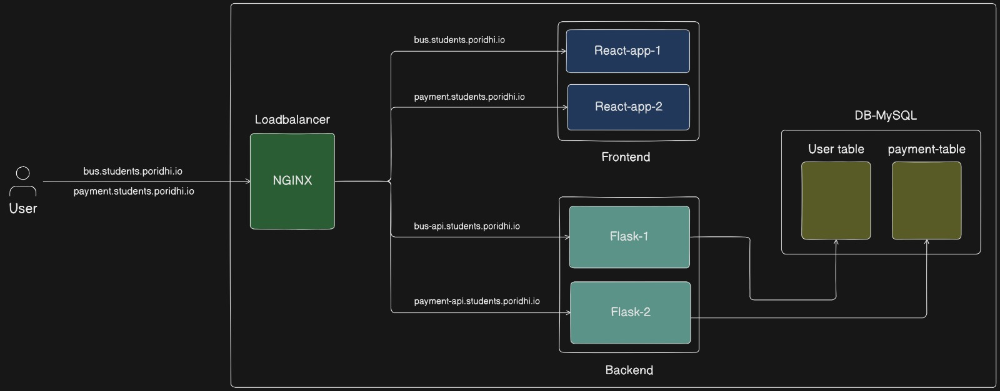
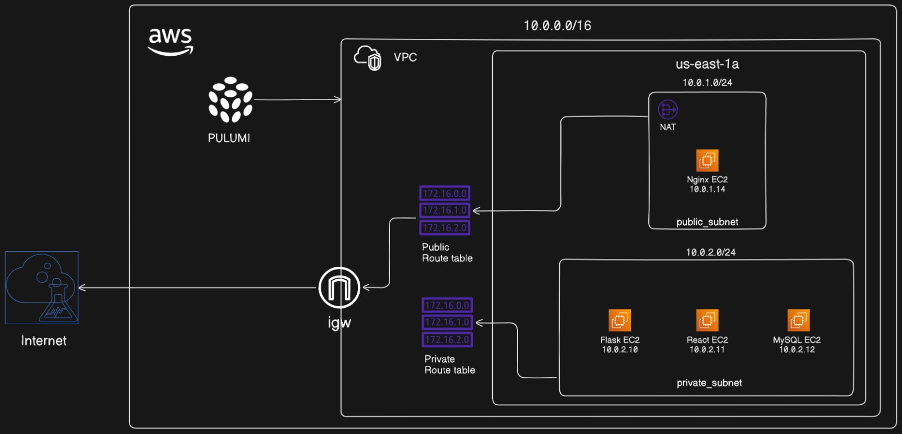

### Full-Stack Application with React Frontend, Flask Backend, and MySQL Database

#### Introduction

In this project, we aim to create a full-stack application that includes a React frontend, a Flask backend, and a MySQL database. The setup involves deploying the application on AWS using a structured VPC with public and private subnets, ensuring secure communication between the components. We then test the application by accessing it through custom domain names set up via local DNS entries.



#### Project Components

1. **VPC Setup**:
   - Configured with one public subnet and one private subnet to separate external-facing services from internal resources.
   - The public subnet hosts resources that need to be accessible from the internet, while the private subnet hosts resources that should remain internal and secure.
   - The VPC includes routing tables, Internet Gateway (IGW) for internet access, and a NAT Gateway to allow private subnet instances to access the internet securely.
   - To see the details, follow the links [AWS-Configure](https://github.com/Galadon123/Full-Stack-Application-with-React-Frontend-Flask-Backend-and-MySQL-Database/tree/main/Full-Project/AWS-Configure)
   

2. **Nginx Instance**:
   - Deployed in the public subnet to handle incoming HTTP requests and route them to the appropriate backend services.
   - Acts as a reverse proxy to distribute traffic between the React frontend applications and the Flask backend API.
   - Configured with a security group to allow HTTP and HTTPS traffic from anywhere, ensuring accessibility.
   - To see the details, follow the link [Nginx-Setup](https://github.com/Galadon123/Full-Stack-Application-with-React-Frontend-Flask-Backend-and-MySQL-Database/tree/main/Full-Project/Nginx-setup)

3. **React Applications**:
   - Two React frontend applications deployed in the private subnet to provide user interfaces for different functionalities (e.g., Bus Application and Payment Application).
   - These applications are not directly exposed to the internet; instead, they are accessed through the Nginx instance in the public subnet.
   - Each React app communicates with its respective Flask backend API using custom domain names set up via local DNS.
   - To see the details, follow the link [React-Application-Setup](https://github.com/Galadon123/Full-Stack-Application-with-React-Frontend-Flask-Backend-and-MySQL-Database/tree/main/Full-Project/REACT)

4. **Flask API**:
   - Flask backend services deployed in the private subnet to handle business logic and interact with the MySQL database.
   - Provides RESTful API endpoints that the React applications consume to perform CRUD operations.
   - Configured with security groups to restrict access to only the Nginx instance and other necessary components.
   - To see the details, follow the link [Flask-Application-1-Setup](https://github.com/Galadon123/Full-Stack-Application-with-React-Frontend-Flask-Backend-and-MySQL-Database/tree/main/Full-Project/flask-application/flask-app-1) [Flask-Application-2-Setup](https://github.com/Galadon123/Full-Stack-Application-with-React-Frontend-Flask-Backend-and-MySQL-Database/tree/main/Full-Project/flask-application/flask-app-2)

5. **MySQL Database**:
   - Deployed in the private subnet to securely store and manage application data.
   - The database is not accessible from the internet, ensuring data security and integrity.
   - The Flask backend services interact with the MySQL database to read and write data, ensuring that the application state is persistently maintained.
   - to see the details, follow the link [MySQL-Setup](https://github.com/Galadon123/Full-Stack-Application-with-React-Frontend-Flask-Backend-and-MySQL-Database/tree/main/Full-Project/mysql)


#### Testing the Project

1. **DNS Configuration**:
   - Ensure that the `/etc/hosts` file on your local machine has the necessary DNS entries to map the custom domain names to the respective IP addresses.
   - Example entries:
     ```sh
     <nginx-instance-public-ip> bus.students.poridhi.io
     <nginx-instance-public-ip> bus-api.students.poridhi.io
     <nginx-instance-public-ip> payment.students.poridhi.io
     <nginx-instance-public-ip> payment-api.students.poridhi.io
     ```

     

2. **Access the Applications**:
   - Open a web browser and navigate to the following URLs to access the applications.
   - Ensure that your local DNS configuration is correctly set up, and that the Nginx instance is running and correctly routing traffic to the backend services.

3. **Testing Bus Application**:
   - **Frontend URL**: `http://bus.students.poridhi.io`
   - **Backend API URL**: `http://bus-api.students.poridhi.io`
   - **Purpose**: To test the React frontend of the bus application which interacts with the Flask backend.
   - **Steps**:
     - Open the URL in the browser.
     - Interact with the interface by adding, updating, and deleting users.
     - Ensure that the data is correctly handled by the Flask backend and stored in the MySQL database.
     - Verify that the React app correctly communicates with the Flask API at `http://bus-api.students.poridhi.io`.
     - Check that the user data is properly reflected in the application and the database.
     - Test the application's responsiveness and functionality across different browsers and devices.

     

4. **Testing Payment Application**:
   - **Frontend URL**: `http://payment.students.poridhi.io`
   - **Backend API URL**: `http://payment-api.students.poridhi.io`
   - **Purpose**: To test the React frontend of the payment application which interacts with the Flask backend.
   - **Steps**:
     - Open the URL in the browser.
     - Interact with the interface by adding, updating, and deleting payments.
     - Ensure that the data is correctly handled by the Flask backend and stored in the MySQL database.
     - Verify that the React app correctly communicates with the Flask API at `http://payment-api.students.poridhi.io`.
     - Check that the payment data is properly reflected in the application and the database.
     - Test the application's responsiveness and functionality across different browsers and devices.

     

#### Conclusion

By following these steps, you can test the full-stack application to ensure all components are correctly integrated and functioning as expected. This involves verifying the frontend interfaces, backend APIs, and the database interactions. If any issues are encountered, ensure to check the respective logs and configurations for troubleshooting.