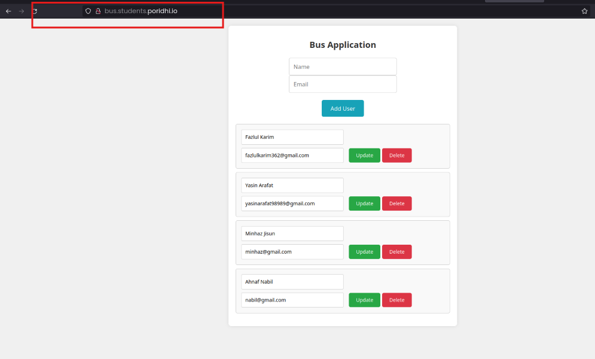

### Full-Stack Application with React Frontend, Flask Backend, and MySQL Database

#### Introduction

In this project, we aim to create a full-stack application that includes a React frontend, a Flask backend, and a MySQL database. The setup involves deploying the application on AWS using a structured VPC with public and private subnets, ensuring secure communication between the components. We then test the application by accessing it through custom domain names set up via local DNS entries.

#### Project Components

1. **VPC Setup**: Configured with one public subnet and one private subnet.
2. **Nginx Instance**: Deployed in the public subnet to handle incoming HTTP requests.
3. **React Applications**: Two React frontend applications deployed in the private subnet, accessible via the Nginx instance.
4. **Flask API**: Flask backend service deployed in the private subnet.
5. **MySQL Database**: Deployed in the private subnet to store and manage application data.

#### Testing the Project

1. **DNS Configuration**:
   - Ensure that the `/etc/hosts` file on your local machine has the necessary DNS entries to map the custom domain names to the respective IP addresses.
   - Example entries:
     ```sh
     <nginx-instance-public-ip> bus.students.poridhi.io
     <nginx-instance-public-ip> bus-api.students.poridhi.io
     <nginx-instance-public-ip> payment.students.poridhi.io
     <nginx-instance-public-ip> payment-api.students.poridhi.io
     ```

     

2. **Access the Applications**:
   - Open a web browser and navigate to the following URLs to access the applications.

3. **Testing Bus Application**:
   - **Frontend URL**: `http://bus.students.poridhi.io`
   - **Backend API URL**: `http://bus-api.students.poridhi.io`
   - **Purpose**: To test the React frontend of the bus application which interacts with the Flask backend.
   - **Steps**:
     - Open the URL in the browser.
     - Interact with the interface by adding, updating, and deleting users.
     - Ensure that the data is correctly handled by the Flask backend and stored in the MySQL database.
     - Verify that the React app correctly communicates with the Flask API at `http://bus-api.students.poridhi.io`.

     

4. **Testing Payment Application**:
   - **Frontend URL**: `http://payment.students.poridhi.io`
   - **Backend API URL**: `http://payment-api.students.poridhi.io`
   - **Purpose**: To test the React frontend of the payment application which interacts with the Flask backend.
   - **Steps**:
     - Open the URL in the browser.
     - Interact with the interface by adding, updating, and deleting payments.
     - Ensure that the data is correctly handled by the Flask backend and stored in the MySQL database.
     - Verify that the React app correctly communicates with the Flask API at `http://payment-api.students.poridhi.io`.

     

#### Conclusion

By following these steps, you can test the full-stack application to ensure all components are correctly integrated and functioning as expected. This involves verifying the frontend interfaces, backend APIs, and the database interactions. If any issues are encountered, ensure to check the respective logs and configurations for troubleshooting.